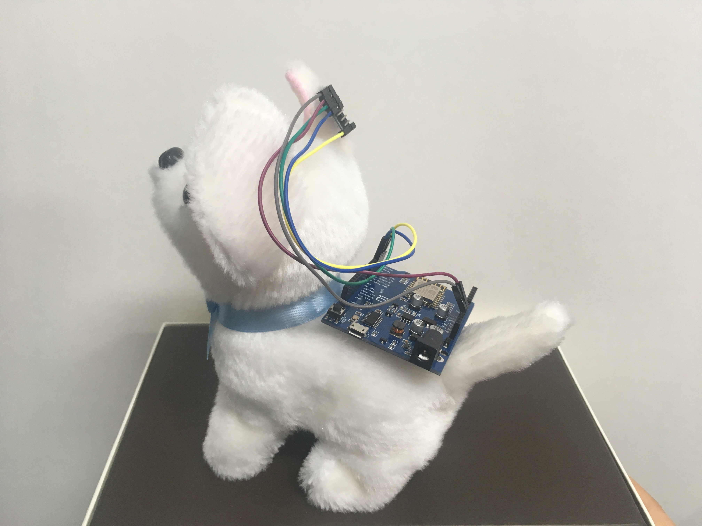
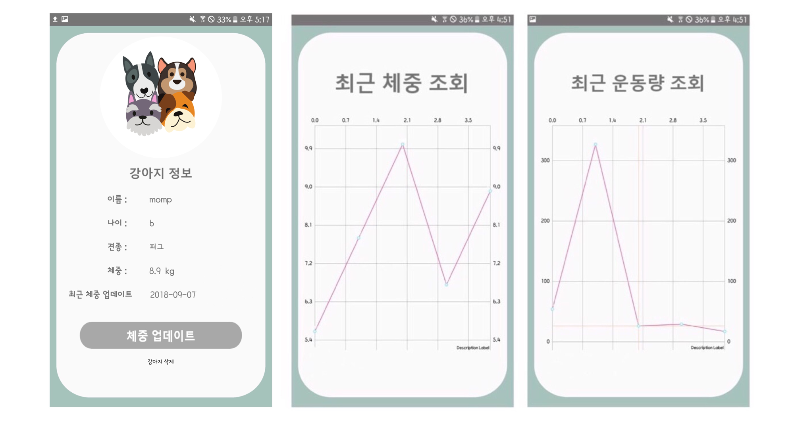

# Don't worry, Dog happy

</img> 

### 반려견을 위한 IoT care system

#### 팀명 : 월이 (박지수, 권재림)

##### 2018년 덕성여자대학교 IT미디어공학과 졸업작품

---

## 기획의도

반려견은 이제 사람들에게 있어 단순한 동물을 넘어, 가족의 존재가 되었습니다.

반려견 비만율이 높아지고, 집에 머무는 시간이 적은 현대인들에게 반려견의 케어는 어렵기만 합니다.

따라서 사람들이 좀 더 효율적이고 손쉽게 반려동물을 케어할 수 있는 방법을 고민해보았고,

사람의 개입이 최소화된 반려견을 위한 복합 IoT care system을 생각하게 되었습니다.

IoT를 통한 자동화를 이용하여 늘어가는 반려견 산업의 니즈를 충족시킬

새로운 반려견 케어의 패러다임으로 Don’t worry Dog happy를 제안합니다.

 

## 작품 소개

#### ✔ 반려견을 위한 핵심기기

반려견을 위해 제작된 만보기(아두이노)와 지정 시간에 사료를 배식해

사람의 개입을 최소화하는 자동배식기(아두이노)을 제작하였습니다.

#### ✔ 반려견에게 최적화된 식사량 

저희가 정의한 CFM(Customized Feed Management)지수를 도입해

사용자가 입력한 반려견의 체중과 만보기에서 수집한 걸음 수를 바탕으로 반려견에게 최적화된 사료를 지급합니다.

#### ✔ 반려견 Care Monitoring Service

사용자는 반려견의 최근 체중변화와 운동량을 그래프로 확인해 반려견의 건강상태를 확인할 수 있습니다.

 

## 개발도구

#### 하드웨어

오픈하드웨어플랫폼: 아두이노, 모바일: 안드로이드

#### 소프트웨어 개발 언어

C, Java, Kotlin

#### 서버개발

DataBase: Mysql

응용서버: Node.js

 

## System Architecture

</img> 

#### 동작설명

- 반려견에게 부착된 만보기로부터 움직임 데이터를 수집한다.
- 만보기는 수집한 데이터를 `Activity DB`에 저장한다.
- `Calorie Managing Server`는 `Activity DB`에 저장된 움직임 데이터와
  사용자가 입력한 체중을 바탕으로 CFM지수를 도출한다.
  - CFM지수 : Customized Feed Management 지수
- 자동배식기는 `Calorie Managing Server`에 요청하여 식사시간이 맞는지, 반려견이 집에 있는지 `Wifi Mac주소`를 활용하여 확인한다.
- 위를 바탕으로 조건이 만족되면, 자동배식기는 FeedBack구조로 구성되어 `Calorie Managing Server`로부터 받은 식사를 배식한다.
- 사용자는 반려견의 초기정보를 입력할 수 있으며, 수시로 체중을 업데이트 하여 CFM지수의 정확도를 높일 수 있다.
- 사용자는 만보기로부터 수집된 데이터와 반려견의 최근 체중 정보를 모바일 어플리케이션을 통해 그래프로 확인할 수 있다.

 

## Android Flow Chart

</img> 

 

## 작품설명

#### 반려견을 위한 핵심기기

- 만보기

  만보기를 대신해 아두이노 D1보드에 가속도 센서를 연결하여 제작하였다.반려견의 걸음 수를 측정한 후 Activity DB에 저장한다.

   
  </img> 

- 자동배식기

  DC모터와 무게센서를 사용하여 식사량 조절이 가능하며,강아지의 위치를  Wifi mac 주소로 파악하여 반려견이 집에 머무는 경우 정해진 시간에 배식을 수행한다.

   
  </img> 

#### 반려견 Care Monitoring Service

- 사용자 어플리케이션

  사용자 어플리케이션을 통해 사용자는 강아지 체중정보를 업데이트 할 수 있다. 
  또한, 반려견의 최근 체중변화와 운동량을 그래프로 확인하여 반려견의 건강상태를 확인할 수 있다.

   
  </img>
